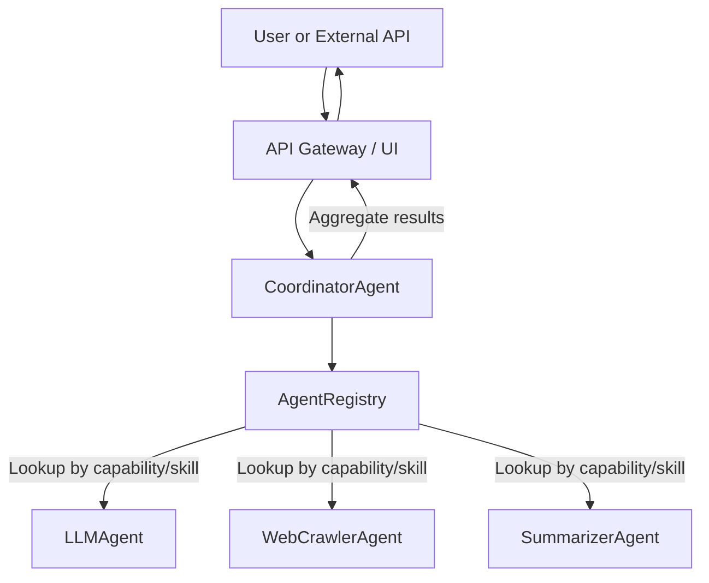
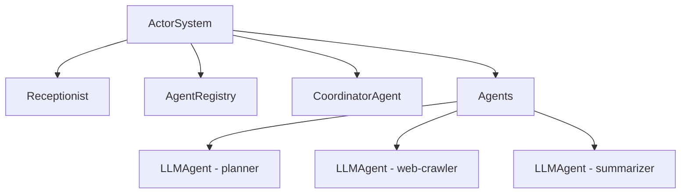
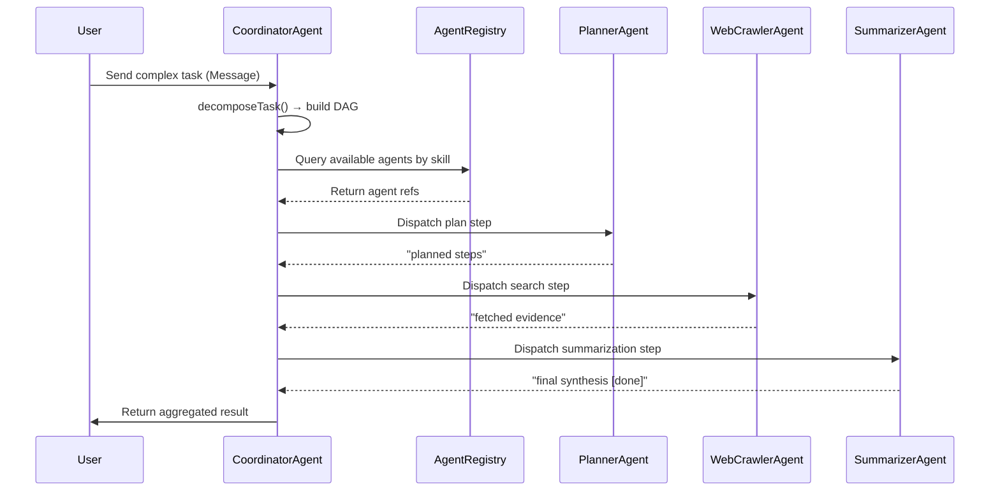
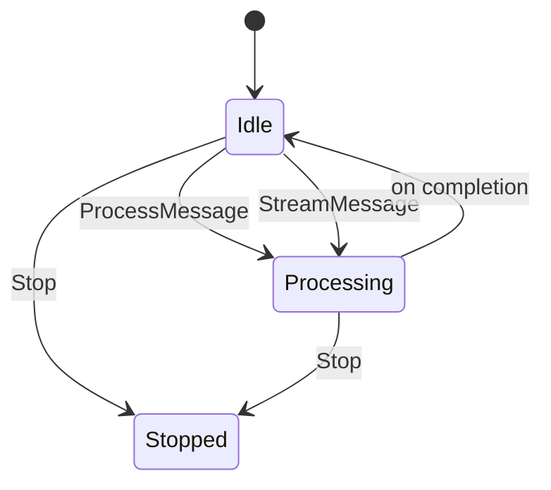
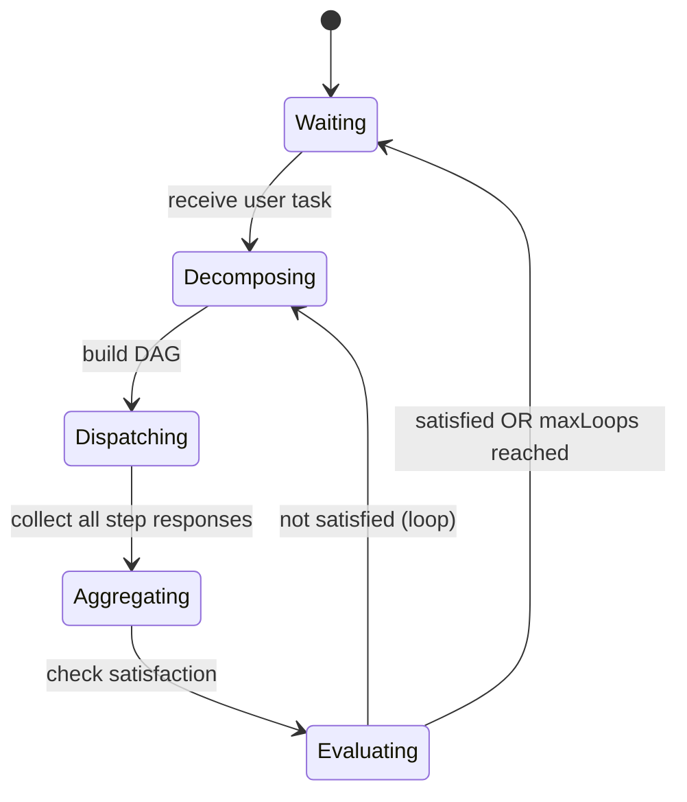
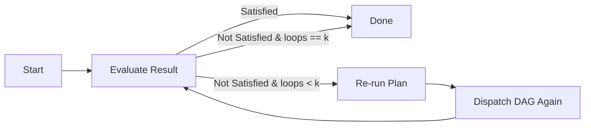
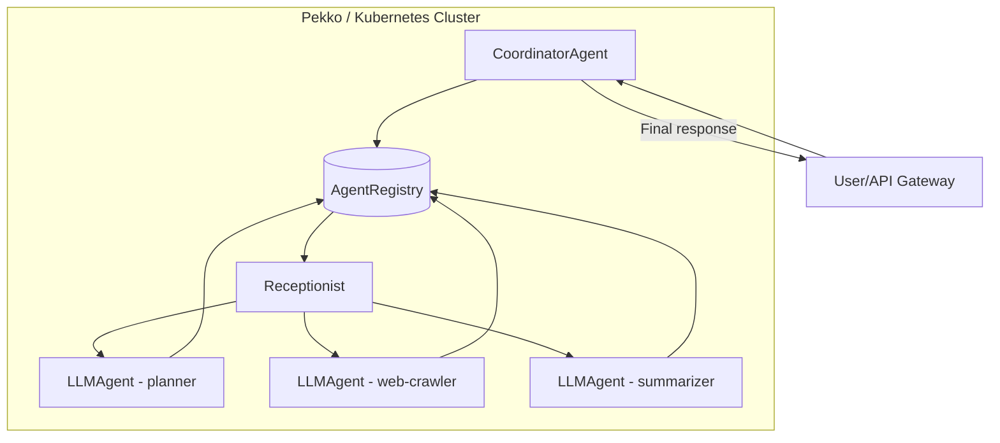

# 🧱 MulticolabNg – Architecture Guide

## 1. Introduction

This document describes the internal architecture of the **MulticolabNg** system — an **actor-based, LLM-driven, multi-agent platform** for distributed problem-solving.
It complements `README.md` by explaining *how* the system coordinates agents, manages dependencies, and ensures consistent task lifecycle execution.

---

## 2. High-Level Design Goals

* **Composable Intelligence** — build complex reasoning pipelines from specialized agents.
* **Dynamic Discovery** — agents register and expose their skills; the system routes tasks automatically.
* **Scalable Execution** — all communication is asynchronous and non-blocking (Pekko typed actors).
* **Self-Reflective Looping** — tasks can iterate until “satisfied” conditions are met.
* **Observability & Extensibility** — future integration with metrics, tracing, and domain ontologies.

---

## 3. System Context Diagram



---

## 4. Actor Hierarchy



**Hierarchy Explanation:**

* `Receptionist` is a built-in Pekko service used for runtime discovery.
* `AgentRegistry` wraps the receptionist API and maintains cached listings.
* `CoordinatorAgent` is the orchestrator and entrypoint for user tasks.
* Each `LLMAgent` (and other specialized agents) runs as an independent actor registered under its own `ServiceKey`.

---

## 5. CoordinatorAgent Internals

The `CoordinatorAgent` performs **multi-phase orchestration**.

### **Phase 1: Task Decomposition**

* Receives the user task message.
* Calls `decomposeTask(task, registry)` to:

  * Infer required **skills** (e.g., planning, summarization, SQL).
  * Map each skill to a corresponding **capability** (e.g., planner → `planner`, summarization → `summarizer`).
  * Query `AgentRegistry` for available agent instances.
  * Construct a **DAG (Directed Acyclic Graph)** of task steps.

### **Phase 2: Execution Orchestration**

* Executes steps in **topological order** (dependencies respected).
* Each step is dispatched as a `ProcessMessage` to the matching agent.
* When a step completes, results are stored in memory and downstream tasks are unblocked.

### **Phase 3: Aggregation**

* After all steps complete, results are concatenated and summarized into a final response.

### **Phase 4: Satisfaction Loop**

* Evaluates the final message:

  * If `content.metadata("satisfied") == "true"` → done.
  * If message text contains `[done]` → done.
  * Otherwise, the coordinator triggers another iteration (loop).
* Number of loops = `ConversationContext.metadata("maxLoops")`, default 1.

---

## 6. Task Lifecycle Diagram



---

## 7. DAG Model

The DAG is implemented implicitly as a sequence of dependent `TaskStep` objects.

```scala
case class TaskStep(
  id: String,
  agentCapability: String,
  instruction: String,
  dependencies: Seq[String] = Seq.empty
)

case class TaskPlan(steps: Seq[TaskStep])
```

Each `TaskStep` represents a **node** in the DAG; dependencies are **edges**.

The DAG is acyclic because each new step only depends on previously created ones in `decomposeTask`.
A typical linear chain:
`planner-step → web-crawler-step → summarizer-step`

---

## 8. Agent State Machines

### **LLMAgent**



### **CoordinatorAgent**



---

## 9. Skill–Capability Mapping

| Skill            | Typical Capability | Description                        |
| ---------------- | ------------------ | ---------------------------------- |
| `planning`       | `planner`          | Decompose tasks into logical steps |
| `search`         | `web-crawler`      | Retrieve relevant data             |
| `ner`            | `ie-agent`         | Extract named entities             |
| `classification` | `classifier`       | Categorize or label content        |
| `sql`            | `sql-agent`        | Query relational data              |
| `summarization`  | `summarizer`       | Generate concise results           |
| `tool-use`       | `orchestrator`     | Execute external actions           |

This mapping drives the planner’s decision in `decomposeTask`.

---

## 10. Satisfaction Evaluation Loop

**Heuristic:**

* If an agent marks `metadata("satisfied") = "true"`, or
* If content text contains `[done]`, the loop terminates.

Otherwise, the coordinator re-runs the pipeline up to **k times**:



---

## 11. Testing Architecture

### Verified by `MultiAgentFlowSpec`

| Scenario          | Verification                                            |
| ----------------- | ------------------------------------------------------- |
| DAG decomposition | Correct step order (planner → web-crawler → summarizer) |
| Dispatch sequence | Steps executed only after dependencies complete         |
| Aggregation       | All agent outputs merged into one                       |
| Satisfaction loop | Retries until `[done]` or metadata satisfied flag       |

### Verified by `LLMAgentSpec`

| Scenario          | Verification                            |
| ----------------- | --------------------------------------- |
| Processing → Idle | After handling message, returns to idle |
| Streaming → Idle  | Handles stream and resumes readiness    |
| Stop signal       | Deregisters and terminates              |

---

## 12. Deployment View



---

## 13. Extensibility Points

| Extension                   | Description                                                    |
| --------------------------- | -------------------------------------------------------------- |
| **Add new Agent**           | Implement `BaseAgent` behavior with new `AgentCapability`      |
| **Custom Planner**          | Replace `decomposeTask` logic with domain-specific DAG builder |
| **New Satisfaction Policy** | Override the default heuristic evaluator                       |
| **Skill Graph Expansion**   | Extend `AgentRegistry` to support multi-skill routing          |
| **Metrics/Tracing**         | Integrate Micrometer, Prometheus, or OpenTelemetry             |

---

## 14. Future Directions

* Persistent DAG and state tracking (replayable workflows)
* Parallel DAG execution with dynamic fan-out/fan-in
* Federated agent registries across clusters
* Integration with **FIBO ontology** and **semantic knowledge graphs**
* Adaptive planning via reinforcement learning feedback

---

## 15. Summary

The **MulticolabNg** architecture provides:

* A modular, actor-driven framework for intelligent task orchestration.
* Strong separation between **coordination**, **execution**, and **discovery**.
* A basis for *enterprise-grade* multi-agent collaboration — scalable, fault-tolerant, and domain-adaptable.

