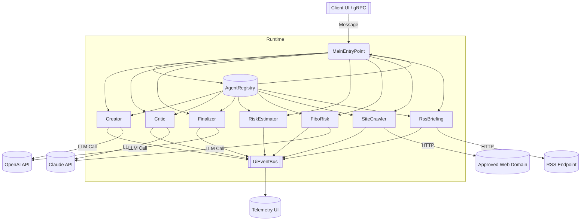
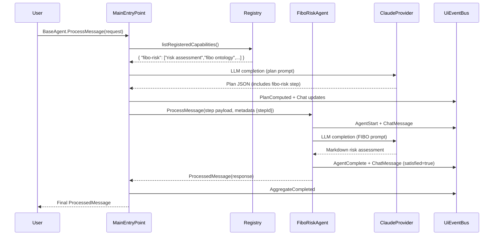

## Agent Collaboration Overview

This system orchestrates multiple intelligent actors around a **MainEntryPoint** coordinator. Each agent contributes domain-specific analysis while the coordinator plans, dispatches, and aggregates results.

### Core Actors

| Actor | Capability | Key Skills | Primary Responsibilities |
| ----- | ---------- | ---------- | ------------------------ |
| **MainEntryPoint** | `coordinator` | planning, routing, aggregation | Creates execution plans, dispatches steps, evaluates completion. |
| **Creator / Critic / Finalizer** | `creator`, `critic`, `finalizer` | ideation, analysis, synthesis | Iterate on product concepts, offer critiques, and converge on deliverables. |
| **RiskEstimator** | `risk` | risk assessment, regulatory compliance | Provides conventional risk scoring and mitigation strategies. |
| **FiboRisk** | `fibo-risk` | risk assessment, FIBO ontology, regulatory analysis | Produces FIBO-aligned risk assessments for banking products. |
| **SiteCrawler** | `web-crawler` | search, summarization | Fetches and condenses external web content from approved domains. |
| **RssBriefing** | `rss-reader` | research, monitoring | Parses RSS feeds and summarizes recent developments. |

The **AgentRegistry** tracks all active capabilities and skills so the coordinator and worker agents can discover each other at runtime.

---

## Interaction Lifecycle

1. **User Request** — A client sends a `Message` to `MainEntryPoint` through gRPC or the UI bridge.
2. **Planning Decision** — `MainEntryPoint` optionally calls the planning routine:
   - Queries the registry (`listRegisteredCapabilities`) to enumerate current agents and their skills.
   - Builds a planning prompt and solicits a JSON execution plan from its LLM provider.
3. **Plan Execution** — Depending on the plan’s strategy (`sequential`, `parallel`, or `adaptive`), steps are dispatched to worker agents. Each step carries:
   - **Content** describing the task.
   - **Metadata** (e.g., `stepId`, `feedUrl`, `url`).
4. **Agent Processing** — Workers perform their domain-specific logic and may consult external services:
   - `SiteCrawler` performs HTTP GET requests and summarizes results.
   - `RssBriefing` downloads and parses XML feeds.
   - `FiboRisk` constructs FIBO-driven prompts and requests completions from its LLM provider.
5. **Telemetry Hooks** — Each agent publishes events to `UiEventBus` (`AgentStart`, `ChatMessage`, `AgentComplete`, `ErrorEvent`) for user-facing dashboards.
6. **Aggregation & Response** — `MainEntryPoint` collates step results via `aggregateResults`, produces a markdown report, and sends a final `ProcessedMessage` to the requester.

---

## System Architecture (Mermaid)

---

## Message Flow Example (Planner → FIBO Risk)

---

## Agent-Specific Interactions

### FiboRiskAgent
- Consumes product descriptions or prior outputs from creator agents.
- Uses hard-coded FIBO dimension glossary and risk scale to structure prompts.
- Returns markdown reports with:
  - Per-dimension ratings (Low/Moderate/High/Critical).
  - FIBO references and mitigation strategies.
  - Regulatory impact summary.

### SiteCrawlerAgent
- Validates URLs against `allowed-domain` configuration.
- Retrieves HTML via Pekko HTTP, strips unwanted tags (Jsoup), truncates to `max-chars`.
- Summarizes results with its LLM provider before replying.

### RssReaderAgent
- Resolves feed URLs from metadata, message text, or defaults.
- Fetches feeds via HTTP, parses RSS/Atom entries (scala-xml), limits to `max-items`.
- Produces briefings highlighting recent entries with links and key insights.

### Core LLM Agents (Creator, Critic, Finalizer, RiskEstimator)
- Each receives instructions via plan steps or direct messages.
- Provide iterative ideation, analysis, and synthesis loops coordinated by MainEntryPoint.
- Mark results as satisfactory using metadata to stop refinement cycles.

---

## Telemetry Events

| Event | Emitted By | Description |
| ----- | ---------- | ----------- |
| `PlanComputed` | MainEntryPoint | Emits planned steps to the UI dashboard. |
| `AgentStart` | Any agent | Signals a new task began (includes step/message IDs). |
| `ChatMessage` | All actors | Streams conversation messages to the UI. |
| `AgentComplete` | Workers | Indicates a step finished and provides response length. |
| `ErrorEvent` | Any agent | Reports failures (HTTP errors, LLM issues, etc.). |
| `AggregateCompleted` | MainEntryPoint | Announces the merged final response is ready. |

---

## Execution Strategies

- **Sequential** — Steps execute one-by-one, respecting dependencies strictly.
- **Parallel** — Independent steps (no unmet dependencies) run concurrently, limited by `maxParallelism`.
- **Adaptive** — Default strategy; starts parallel but may degrade to sequential when contention occurs.

These strategies are selected per plan and influence how the coordinator dispatches to worker agents.

---

## Extending Interactions

1. **New Agent Registration**
   - Implement a `BaseAgent`-compatible behavior.
   - Provide configuration (`type`, `provider`, `skills`, optional `config` map).
   - Register automatically by calling `registry.register(self, capability, skills)` in the actor setup.

2. **Planner Awareness**
   - Ensure the agent exposes meaningful `skills` so planners and other agents can discover it through the registry.
   - LLMAgent obtains the capability snapshot via `registry.listRegisteredCapabilities()` before planning.

3. **Telemetry Integration**
   - Use the `UiEventBus` to publish lifecycle events, keeping dashboards consistent across agents.

---

## Operational Considerations

- **Timeouts & Retries**: Coordinated agents rely on Pekko’s ask timeouts (e.g., `ask-timeout` in configuration). Consider longer durations for network-bound crawlers.
- **Domain Restrictions**: External data agents enforce domain whitelists to avoid accidental exfiltration or compliance breaches.
- **LLM Provider Mix**: Each agent can leverage distinct providers (OpenAI, Claude, Vertex, etc.) to balance cost, capability, and latency.
- **Satisfaction Loop**: If results lack `satisfied=true` metadata or `[done]` markers, the coordinator can re-run plans to improve answers.

---

## Summary

The system combines deliberate planning, targeted domain expertise, and continuous telemetry into a cohesive multi-agent workflow. By treating each agent as a composable capability with well-defined interactions, teams can extend the platform (e.g., the new **FiboRiskAgent**) without disrupting existing flows. This document should serve as the reference blueprint for understanding runtime collaboration, designing new agents, and operating the platform effectively.
