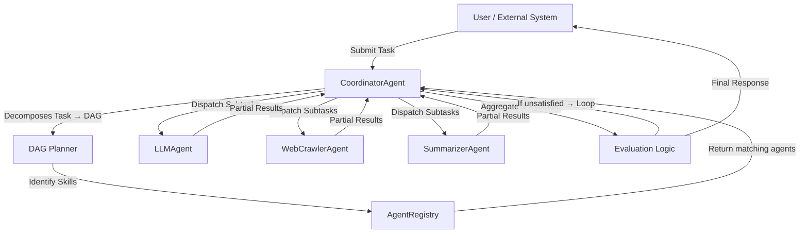
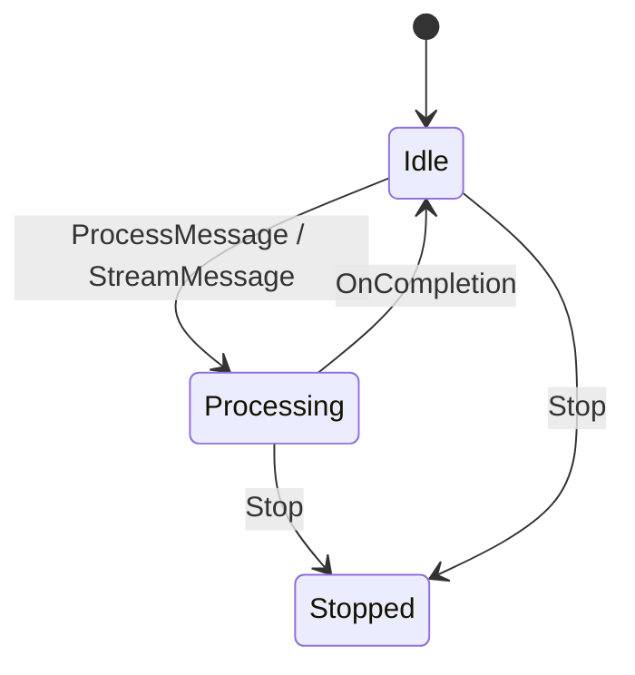
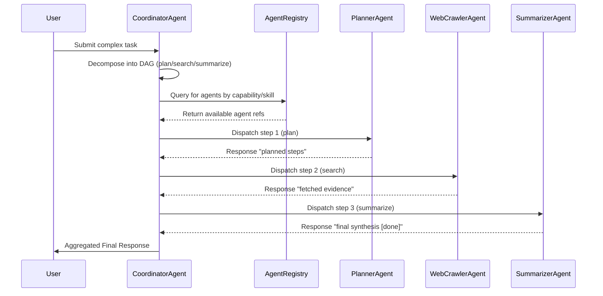
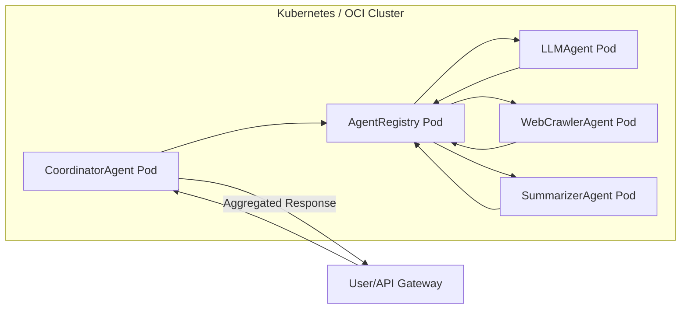
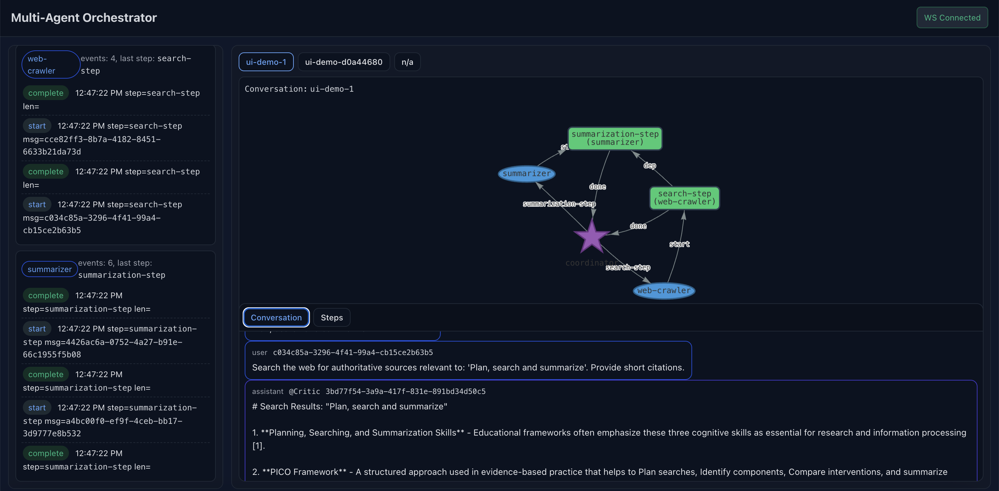

# 🧠 MulticolabNg — Multi-Agent Collaboration Framework

## Overview

**MulticolabNg** is a multi-agent coordination system designed to orchestrate intelligent agents (LLM-based or specialized computational agents) using an **Actor-based architecture (Apache Pekko / Akka-Typed)**.

The system enables:

* Decomposition of complex user tasks into executable **Directed Acyclic Graphs (DAGs)** of subtasks.
* Dynamic discovery of specialized agents via a distributed **Agent Registry**.
* **Parallel and dependency-aware task execution**.
* **Iterative refinement loops** — the coordinator re-invokes agents until the task result is *satisfactory*.
* Easy integration with **LLM connectors** and external reasoning services.

---

## 🏗️ Architecture Overview

The system follows a **hierarchical multi-agent pattern** composed of:

* A **CoordinatorAgent** (planner + orchestrator)
* Several **WorkerAgents** (e.g., `LLMAgent`, `WebCrawlerAgent`, `SummarizerAgent`, etc.)
* An **AgentRegistry** providing dynamic service discovery and skill matching
* A **Receptionist** layer from Pekko for runtime registration



---

## 🧩 Core Components

### **1. CoordinatorAgent**

The central orchestrator responsible for:

* Receiving tasks from users or upstream services.
* Decomposing them into a **DAG of steps** via `decomposeTask`.
* Managing dependency ordering and distributing subtasks to specialized agents.
* Collecting and aggregating responses.
* Optionally looping execution until a *satisfactory* result is reached.

**Key Responsibilities**

* DAG creation and dependency resolution
* Dispatch management
* Aggregation and satisfaction loop

**Satisfaction Logic**

* Based on:

  * `response.content.metadata("satisfied") == "true"`, or
  * `response.content.text` contains `[done]` (case-insensitive).
* Maximum retry loops configurable via `ConversationContext.metadata("maxLoops")`, defaulting to **1**.

---

### **2. LLMAgent**

An intelligent worker agent providing LLM-driven processing.
Each `LLMAgent` exposes:

* A **capability** (e.g., `"planner"`, `"summarizer"`, `"sql-agent"`).
* One or more **skills** (e.g., `"planning"`, `"reasoning"`, `"summarization"`).

**Lifecycle**

* Registers its **capability** and **skills** with `AgentRegistry` on startup.
* Processes incoming messages asynchronously.
* Deregisters on shutdown or stop signal.

**Behavioral States**

| State        | Description                                |
| ------------ | ------------------------------------------ |
| `Idle`       | Waiting for new task                       |
| `Processing` | Handling a user or streamed message        |
| `Stopped`    | Gracefully terminated after deregistration |

**State Transition Example**



---

### **3. AgentRegistry**

A centralized discovery service for all agents.

**Responsibilities**

* Register and deregister agent capabilities.
* Track agents’ declared **skills**.
* Support discovery queries by:

  * `findAgent(capability)`
  * `findAgentsBySkill(skill)`
  * `findAgentsByAnySkill(Set)`
  * `findAgentsByAllSkills(Set)`
* Maintain an optional **subscription-based cache** using `Receptionist.Subscribe` to stay up-to-date.

**Skill vs Capability**

| Concept        | Description                                     | Example                                  |
| -------------- | ----------------------------------------------- | ---------------------------------------- |
| **Skill**      | Atomic functional ability an agent can perform. | `summarization`, `planning`, `sql-query` |
| **Capability** | Concrete agent type that groups related skills. | `summarizer`, `planner`, `sql-agent`     |

---

### **4. Message Model**

Each message follows a structured format:

```scala
Message(
  role: MessageRole,           // User / Assistant / System
  content: MessageContent,     // text + metadata
  conversationId: String
)
```

The **ConversationContext** carries execution metadata:

```scala
ConversationContext(
  id: String,
  metadata: Map[String, String] // e.g. maxLoops, taskId, etc.
)
```

---

## 🔄 Task Execution Flow



---

## 🧪 Testing Strategy

The project includes comprehensive unit and integration tests verifying both **state transitions** and **multi-agent coordination**.

### `LLMAgentSpec`

Validates:

* Correct processing of messages.
* Return to idle state after completion.
* Handling of streaming responses.
* Graceful shutdown (deregistration + termination).

### `MultiAgentFlowSpec`

Integration tests for `CoordinatorAgent`:

1. **DAG Decomposition** — verifies steps correspond to planner → web-crawler → summarizer.
2. **Dependency Enforcement** — ensures next step triggers only after previous completes.
3. **Aggregation** — final message combines results from all steps.
4. **Satisfaction Looping** — Coordinator retries until `[done]` or `"satisfied" -> "true"` detected.

---

## ⚙️ Configuration & Deployment

### Environment Variables

| Variable         | Description                                  |
| ---------------- | -------------------------------------------- |
| `OPENAI_API_KEY` | API key for LLM provider                     |
| `LOG_LEVEL`      | System log level                             |
| `REGISTRY_CACHE` | Enable local subscription cache (true/false) |

### Deployment

MulticolabNg can be deployed:

* As a **Spring Boot / Pekko cluster microservice**, or
* Inside **Kubernetes** pods (agents scale horizontally).

Example high-level deployment view:



---

## 🧩 Extensibility

* **New Agents:** Add custom `LLMAgent` subclasses with unique capabilities.
* **Custom Providers:** Plug in additional LLM backends via `LLMProvider` trait.
* **Skill Graph Expansion:** Extend `decomposeTask` heuristics to include domain-specific logic.
* **Observability:** Integrate with Prometheus/Micrometer for per-agent metrics.

---

## 📂 Repository Structure

```
src/
 ├── main/
 │   ├── scala/net/kaduk/agents/
 │   │    ├── CoordinatorAgent.scala
 │   │    ├── LLMAgent.scala
 │   │    └── BaseAgent.scala
 │   ├── scala/net/kaduk/infrastructure/registry/
 │   │    └── AgentRegistry.scala
 │   └── scala/net/kaduk/domain/
 │        └── model classes
 ├── test/
 │   ├── scala/net/kaduk/agents/LLMAgentSpec.scala
 │   └── scala/net/kaduk/integration/MultiAgentFlowSpec.scala
```

---

## 📈 Future Enhancements

* Persistent **Agent Directory** with historical performance metrics.
* Incorporation of **learning feedback loops** for skill scoring.
* Support for **tool-aware prompting** and dynamic **skill chaining**.
* **Multi-conversation contexts** (parallel DAG execution).

# 🚀 How to Run the Project (Local Development)

## 🧩 Prerequisites

* **Scala 3.x**
* **sbt ≥ 1.9.x**
* **Java 21**
* Internet connection (for LLM API calls)
* API keys for at least one provider (OpenAI, Vertex AI, Anthropic, etc.)

---

## 🧠 Step 1 — Set up Environment Variables

Before running, export the required API keys for the LLM providers you plan to use.
You can set multiple — the system will select the appropriate one based on configuration.

```bash
# ==== OpenAI ====
export OPENAI_API_KEY=sk-xxx
export OPENAI_SCALA_CLIENT_API_KEY=xxx

# ==== Vertex AI ====
export VERTEXAI_PROJECT_ID=xxxx
export VERTEXAI_LOCATION=xxxx
export VERTEX_API_KEY=xxxxx

# ==== Anthropic (Claude) ====
export ANTHROPIC_API_KEY=xxxxx
```

> 💡 You can add these lines to your `~/.bashrc`, `~/.zshrc`, or a dedicated `.env` file.

---

## 🧰 Step 2 — Start the Coordinator / Multi-Agent Platform

Open your **first terminal** and launch the main coordination system:

```bash
cd /path/to/MulticolabNg
sbt "runMain net.kaduk.MainApp"
```

This starts the **CoordinatorAgent**, **AgentRegistry**, and all core infrastructure components (Pekko typed actor system, Receptionist, etc.).

**Expected log output:**

```
[INFO] AgentRegistry started
[INFO] CoordinatorAgent up and listening...
[INFO] Waiting for incoming HumanAgentClient connections...
```

---

## 💬 Step 3 — Start the HumanAgentClient

Open a **second terminal** and start the interactive **HumanAgentClient**, which connects via gRPC:

```bash
cd /path/to/MulticolabNg
sbt -Dgrpc.port=6060 "runMain net.kaduk.HumanAgentClient"
```

This client sends user tasks (e.g., “Summarize this report”, “Plan a data extraction pipeline”) to the `CoordinatorAgent` over gRPC.

**Expected output:**

```
[INFO] Connected to CoordinatorAgent on port 6060
Type your instruction below:
> 
```

---

## 🔁 Step 4 — Example Interactive Session

```
> Analyze the European AI Act and summarize its implications for financial compliance.

[PlannerAgent]: decomposing task into 3 steps
[WebCrawlerAgent]: gathering documents
[SummarizerAgent]: generating summary... [done]

Final Response:
"The European AI Act establishes unified risk-based rules for AI governance in finance..."
```

## 🔁 Step 5 — Run UI for conversation observation

```
cd ui && npm run dev
```



## 🧩 Notes

* You can run multiple agent nodes by changing ports or running them in containers:

  ```bash
  sbt -Dgrpc.port=6060 "runMain net.kaduk.HumanAgentClient"
  ```

* Environment variables are read at startup; restarting the agent is required if keys change.

* For local testing, no cloud setup is needed — the framework automatically detects available LLM connectors.

---

## ✅ Quick Summary

| Terminal     | Command                                                     | Purpose                                                         |
| ------------ | ----------------------------------------------------------- | --------------------------------------------------------------- |
| **1**        | `sbt "runMain net.kaduk.MainApp"`                           | Starts main coordination platform (Registry + CoordinatorAgent) |
| **2**        | `sbt -Dgrpc.port=6060 "runMain net.kaduk.HumanAgentClient"` | Launches interactive human client via gRPC                      |
| **Env Vars** | `export OPENAI_API_KEY=...` etc.                            | Configure credentials for selected LLM provider                 |


