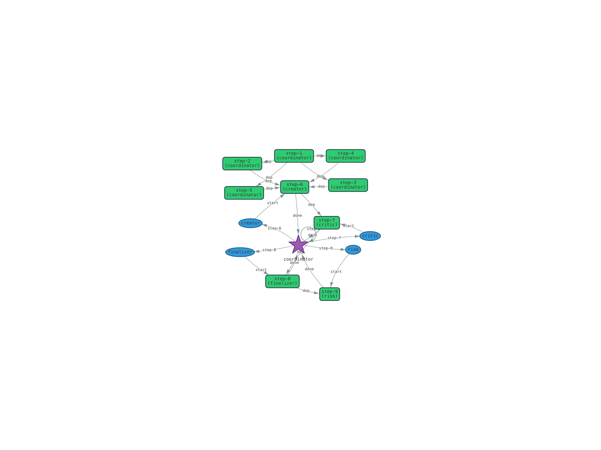

## Multi‑Agent LLM System Documentation


This report documents a **Scala/Apache Pekko** system that orchestrates multiple large‑language‑model (LLM) agents.  The repository uses the _typed actor_ APIs from Apache Pekko to build a concurrent, message‑based architecture.  Each agent is implemented as a strongly typed actor, and the overall coordinator distributes work to specialized agents or falls back to local LLM invocations.  An HTTP/gRPC layer exposes the system, and a WebSocket interface streams telemetry events.

## 1 Overview

The main entry point (`MainApp`) bootstraps the application by loading configuration, spawning a **registry** for agents, creating a telemetry bus, and then starting several LLM agents based on the `application.conf` configuration.  Agents are discovered and registered via the Pekko **Receptionist** and are looked up by capability (e.g., “creator”, “critic”, “risk”).  The system exposes two services:

* A **gRPC API** (`AgentServiceImpl`) whose `chat` method accepts a stream of `ChatMessage` (conversation ID, content, role) and returns a stream of `ChatResponse`.  It converts gRPC messages into the internal `Message` domain and uses the coordinator agent to generate responses.
* A **WebSocket UI** (`TelemetryRoutes`) that emits JSON‑encoded telemetry events such as planning progress, step dispatches, agent lifecycle events and errors.  Clients connect via `/ws` and receive a heartbeat ping every 10 seconds to keep the connection alive.

The system relies on **Pekko Typed**, the modern API for typed actors.  In the typed API every actor declares the exact type of messages it accepts, and the type system prevents sending unexpected messages.  Classic actors remain supported, but the typed API is preferred for safer and more predictable code.  Actors communicate only via message passing and never share mutable state.  This design enables scalability and fault isolation.

At a high level, a **user** sends a message to the **coordinator agent** (the `llm‑main` agent).  If planning is enabled, the coordinator asks an LLM provider (OpenAI/Claude/Ollama/Vertex) to **decompose the user’s task into a plan**.  The plan lists a sequence of steps, each with an identifier, description, required skills and a target capability.  The coordinator then executes the steps either sequentially, in parallel or using an adaptive strategy, dispatching work to specialised agents (creator, critic, risk, finaliser, etc.) or falling back to local LLM invocations when no agent is found.  Results are aggregated and returned to the user as a single assistant response.  Telemetry events describing the plan, step dispatches, completions, aggregates and errors are published to the UI event bus.

The concept of **AI agents** with plan‑and‑execute loops has gained traction in recent years: they reason with large language models (LLMs) to autonomously develop plans for achieving tasks and use real‑world tools to execute those plans.  The system described here embodies this pattern in Scala: an LLM decomposes the task, the coordinator orchestrates specialised workers, and the user receives a coherent answer.

## 2 Domain Model

The domain model defines the data structures exchanged between actors, providers and external services.  Key entities include:

* **Message** – represents a piece of conversation.  Each message has a unique ID (UUID), a `role` (user/assistant/system/agent), a `MessageContent` (`text` and optional metadata), a `conversationId`, a timestamp and an optional `agentId`.  The message carries the content that is sent to or from an agent.
* **MessageRole** – an enumeration of possible roles (`User`, `Assistant`, `System`, `Agent`).  System messages are generated by the coordinator to instruct the LLM; agent messages come from specialised worker agents.
* **MessageContent** – wraps the textual body of a message and any associated metadata.
* **ConversationContext** – holds the conversation ID, a vector of previous messages and per‑conversation metadata.  It offers a method `addMessage` that appends a new message to the history and returns a new context.
* **PlanStep** – models a single step in a decomposed plan.  A step has an ID, a textual description, a set of required skills, a set of dependencies on other steps, an optional target capability (the name of the agent expected to execute the step), a status (pending/running/completed/failed/skipped) and optional result and error fields.
* **ExecutionPlan** – encapsulates an entire plan.  It has an ID, a `conversationId`, the original user query, a sequence of `PlanStep` objects, an execution strategy (`Sequential`, `Parallel` or `Adaptive`) and a maximum degree of parallelism.
* **PlanningRequest** and **PlanningResponse** – request to generate a plan for a user query with context and available agents; response containing the `ExecutionPlan`, reasoning and confidence.
* **AgentCapability** – describes an agent’s capability: name, `AgentType` (LLM, tool, coordinator, human, worker, specialist, orchestrator, monitor), a set of skills, provider name and configuration (e.g., system prompt).  Agents register their capability with the registry so the coordinator can discover them.
* **AgentStatus** – enumerates states (`Idle`, `Busy`, `Offline`, `Failed`), used for monitoring.

The domain model lives in the `net.kaduk.domain` package and is serialised to JSON for telemetry and gRPC messages.  It defines the typed language through which the actors communicate.

## 3 LLM Providers

An **LLM provider** abstracts over different large‑language‑model back‑ends and exposes a unified interface:

* `name`: human‑readable identifier of the provider.
* `completion(messages: Seq[Message], systemPrompt: String): Future[String]` – sends a sequence of messages and a system prompt to the provider and returns the final response text.
* `streamCompletion(messages: Seq[Message], systemPrompt: String): Source[StreamToken, NotUsed]` – similar to `completion` but returns a stream of partial tokens.  `StreamToken` includes the token content, an ID, a completion flag and an optional error.
* `close(): Future[Unit]`: releases resources.

Several provider implementations reside in `net.kaduk.infrastructure.llm`:

| Provider | Features | Notes |
|---------|---------|------|
| **OpenAIProvider** | Connects to OpenAI’s models via the Cequence Scala client.  Supports both streaming and non‑streaming completions, defaulting to non‑streaming.  Uses the configured model (e.g., `gpt‑4`) and passes messages as OpenAI chat completions. | Suitable for production with API keys stored in `application.conf`. |
| **ClaudeProvider** | Wraps Anthropic’s models (e.g., `claude‑3‑5‑sonnet`) via the Cequence Anthropic client.  The current implementation does not support streaming and always returns the full completion in one result. | Requires an Anthropic API key. |
| **OllamaProvider** | Talks to an **Ollama** server (by default `http://localhost:11434/v1/`) and uses the Cequence OpenAI client to send requests.  It defaults to `llama3` but uses `gpt‑3.5‑turbo` in the settings. | Useful for local experimentation. |
| **VertexProvider** | Placeholder for Google Vertex AI (Gemini) support.  Currently returns a mock “not yet implemented” message. | Implementation to be completed. |
| **GeminyProvider** | Empty stub reserved for future provider integration. |

Developers can add new providers by implementing the `LLMProvider` trait and registering them in the configuration.  Provider factories (`LLMProviderFactory`) create provider instances based on names and configuration parameters.

## 4 BaseAgent Protocol

All agents extend the **BaseAgent** trait in `net.kaduk.agents`.  The protocol defines message types used to interact with agents:

* **Command** – sealed trait for incoming messages.  Important subtypes include:
  * `ProcessMessage(message, context, replyTo)`: ask the agent to process a user message.  `replyTo` is an untyped `ActorRef[Any]` so that different response types can be sent.
  * `StreamMessage(message, context, replyTo)`: similar to `ProcessMessage` but requests a streaming response.
  * `Stop`: politely terminate the agent; the actor deregisters from the registry and stops.
  * `GetStatus`: ask the agent about its current status.
  * `NoOp`: ignored message used for testing.
* **Response** – sealed trait for responses:
  * `ProcessedMessage(message, updatedContext)`: returned when an agent finishes processing; includes the assistant message and updated context.
  * `ProcessingFailed(error, messageId)`: returned if the agent encounters an error.
  * `AgentStatusResponse(status, load)`: status information used by monitoring.
* **StreamResponse** – sealed trait used when streaming is requested:
  * `StreamChunk(content, messageId)`: partial result token.
  * `StreamComplete(message)`: final message when streaming completes.
  * `StreamError(error)`: error during streaming.

The `withLogging` helper enriches MDC logging context with the conversation ID and agent ID, ensuring logs are annotated consistently.


## 5 Agent Registry and Discovery

The **Agent Registry** (`net.kaduk.infrastructure.registry.AgentRegistry`) abstracts the underlying Pekko Receptionist and provides a uniform API for registering, deregistering and discovering agents.  When an agent starts it calls `registry.register(selfRef, capability, skills)`, which:

* Normalises the capability name (lower–cases and trims it) and constructs a `ServiceKey` using the capability.  Pekko’s receptionists track a mapping between service keys and actor references, so this key enables other actors to find the agent.
* Subscribes to the receptionist so that updates to the service listing are cached locally.  A small subscriber actor updates a `capIndex` map whenever a new agent registers or deregisters.  This cache avoids hitting the receptionist for every lookup.
* Stores the agent’s capability (including its declared skills) in a concurrent map.  Skills allow more flexible discovery: callers can request an agent by capability (`findAgent`), by any skill (`findAgentsByAnySkill`) or by all skills (`findAgentsByAllSkills`).
* Deregistration removes the actor from both the receptionist and the cache.

This registry design means the coordinator can discover specialised agents on demand.  For example, if a plan step declares `targetCapability = "critic"` then the registry will return the first available critic agent.  If no agent matches exactly, the registry falls back to skill‑based search: `findAgentsByAllSkills(Set("ner", "sentiment"))` returns an agent whose skill set is a superset of the required skills.  These functions return `Future[Option[ActorRef]]` or `Future[Set[ActorRef]]` to avoid blocking the actor.


## 6 LLMAgent Planning and Execution


The **LLMAgent** is the heart of the system.  Each agent wraps an `LLMProvider`, exposes the `BaseAgent` protocol and optionally enables **planning**.  With planning enabled the coordinator (the `llm‑main` agent) implements a plan‑and‑execute loop inspired by recent research on LLM‑driven agents.  The flow is:

1. **Receive user message** – when `ProcessMessage` arrives, the agent logs the message and publishes it to the UI event bus as a `ChatMessage`.  If planning is enabled and `shouldPlan` returns true (currently always), the agent dispatches an internal `PlanTask` message; otherwise it falls back to direct execution (`executeDirectly`), invoking the LLM provider immediately.
2. **Planning** – `PlanTask` triggers `createPlan`.  The agent first calls `discoverAgentCapabilities` to obtain a map of available capabilities (creator, critic, finalizer, risk, etc.), then builds a planning prompt including the user query and the list of agents.  It sends two system messages to the UI bus (system prompt and user prompt) and calls `provider.completion` with these messages.  The LLM must respond with a **valid JSON object** describing the plan: an array of steps and an execution strategy.  The agent sanitises the JSON (removing code fences) and calls `parsePlan`, which uses Jackson to parse the `steps` array, populate `PlanStep` objects, and determine the `ExecutionStrategy`.  If parsing fails a planning failure is published and the agent falls back to direct execution.
3. **Emit plan** – after successfully parsing the plan, the agent publishes a `PlanComputed` event to the UI bus with `StepInfo` objects.  It then sends itself an `ExecutePlan` command containing the `ExecutionPlan` and conversation context.
4. **Execute plan** – depending on the plan’s strategy the agent chooses one of three execution functions:
   * **Sequential**: executes steps in order, honouring dependencies.  For each step it calls `executeStep`; results are accumulated in a map and aggregated at the end via `aggregateResults`.  The final response includes headings per step (e.g., “### Step 1: Extract named entities”) and is sent back as a `ProcessedMessage`.  Errors during a step result in a `ProcessingFailed` response.
   * **Parallel**: extracts all independent steps (with no dependencies) and executes them concurrently up to `maxParallelism`.  It collects successes and failures separately; after all tasks finish it aggregates successes into a final answer and reports failures via `ErrorEvent`s.
   * **Adaptive**: currently defaults to the parallel strategy but could fall back to sequential if contention is detected.
5. **Execute step** – `executeStep` tries to find the best agent for a step.  Priority order is: explicitly assigned agent ID (not yet used), `targetCapability`, agents matching all required skills, agents matching any required skill.  If an agent is found, the step is delegated via the `delegateToAgent` function.  Otherwise `executeSelfContained` runs the step locally using the LLM provider.  Delegated steps send a `ProcessMessage` to the worker agent and await a `ProcessedMessage` or `ProcessingFailed`.  Both delegation and self‑execution publish `ChatMessage`, `StepDispatched`, and `StepCompleted` events to the UI bus.

Fallbacks ensure robustness: if planning fails the agent executes the request directly; if no specialised agent is found for a step the LLM provider processes the step; if a step fails, the error is reported and execution continues (parallel strategy) or aborts (sequential strategy).

## 7 Telemetry and UI


Real‑time observability is provided via a **UI event bus** and **WebSocket routes**.  The `UiEventBus` defines events describing planning, execution and errors.  Producers publish events via `UiEventBus.Publish`; subscribers register with `UiEventBus.Subscribe`.  The bus maintains a rolling history (last 500 events) and replays it to new subscribers.  Events include:

| Event | Fields | Description |
|------|--------|------------|
| `PlanComputed` | `conversationId`, list of `StepInfo` | Emitted when a plan is generated; includes step IDs, target capability and dependencies. |
| `StepDispatched` | `conversationId`, `stepId`, `capability`, `messageId` | A step was dispatched to a worker or executed locally. |
| `StepCompleted` | `conversationId`, `stepId` | A step finished successfully. |
| `AggregateCompleted` | `conversationId`, `textLength` | The final aggregated result was produced, with length (characters). |
| `AgentStart` / `AgentComplete` | `conversationId`, `agent`, `stepId`, `messageId`, `length` | Worker start and completion of a step or direct task. |
| `ChatMessage` | `conversationId`, `role`, `messageId`, `text`, `agent` | Any message exchanged between the system and user/agents. |
| `ErrorEvent` | `conversationId`, `message` | An error occurred during planning or execution. |

`TelemetryRoutes` exposes these events over **WebSocket** at `/ws`.  Each client connection spawns a subscriber actor and an internal queue that buffers up to 512 messages.  The server merges the event stream with a 10‑second ping (to keep connections alive) and serialises events using the `UiEventBus.toJson` helper.  Clients may also trigger a demo by sending an HTTP `GET /demo?task=...&convId=...`: the server sends the task to the coordinator and returns immediately.  A simple `/health` endpoint returns `ok` for liveness checks.

## 8 gRPC Service


`AgentServiceImpl` implements the `AgentService` defined in `src/main/protobuf/agent_service.proto`.  The service exposes two methods:

* **`chat(stream ChatMessage)`** – a bidirectional stream.  Incoming `ChatMessage` objects carry a conversation ID, content, role and metadata.  For each incoming message, `AgentServiceImpl` constructs a `ConversationContext` and a domain `Message`, then calls `askCoordinator` which sends a `ProcessMessage` to the coordinator actor using the ask pattern.  When the coordinator responds with `ProcessedMessage` or `ProcessingFailed` the server converts it into a `ChatResponse` and streams it back to the client.  This allows streaming of assistant responses and errors.
* **`GetAgentStatus`** – returns a trivial `AgentStatusResponse` with “active” status and zero active conversations.  A more sophisticated implementation could query the agent registry for load metrics.

The gRPC server binds to port 6060 in `MainApp`, enabling clients (e.g., a JavaScript UI) to interact with the system over HTTP/2.

## Step 9 — Run UI for conversation observation

```
cd ui && npm run dev
```




## 10 Configuration and Bootstrap


Configuration resides in `application.conf` and `dev.conf`.  Key parameters include Pekko cluster settings, HTTP server options and LLM provider credentials (OpenAI API key, model names, etc.).  Agents are defined under `agents { … }` with fields `provider`, `agentType` (`llm` or `llm-main`), `capability`, `skills`, `systemPrompt` and custom names.  For example, a creator agent might be configured as:

```hocon
agents {
  creator {
    provider     = "openai"
    agentType    = "llm"
    capability   = "creator"
    skills       = [ "analysis", "communication" ]
    systemPrompt = "You are a creative assistant."
  }
  llm-main {
    provider     = "openai"
    agentType    = "llm-main"
    capability   = "orchestrator"
    skills       = [ "planning" ]
    systemPrompt = "You are a task planning expert."
  }
}
